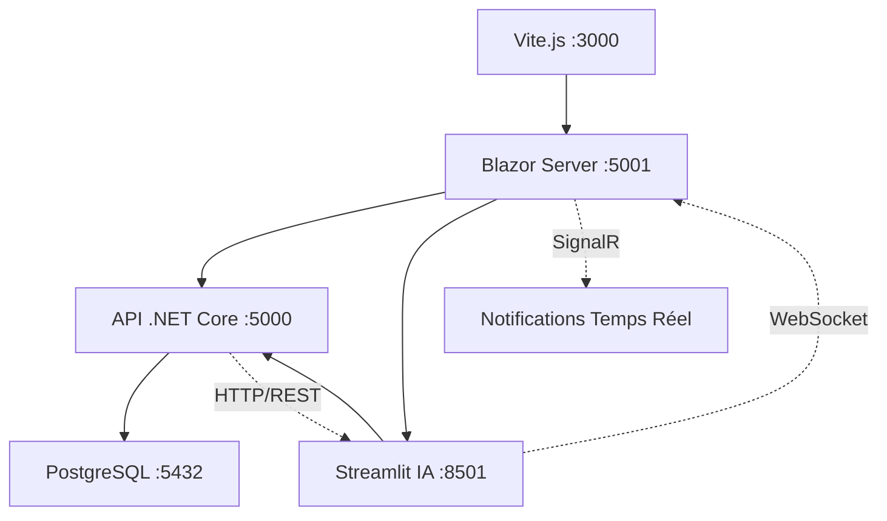

# FormBuilder Pro - FAQ Technique Blazor Stack

## Questions-Réponses sur l'Architecture Pure Blazor

### 1. Architecture Générale

**Q: Quelle est l'architecture complète de FormBuilder Pro avec Blazor ?**

**R:** FormBuilder Pro utilise une architecture multi-couches pure :
- **Frontend** : Blazor Server avec composants MudBlazor
- **Backend** : API .NET Core 8 avec Entity Framework Core
- **Base de données** : PostgreSQL avec migrations automatiques
- **Intelligence Artificielle** : Python Streamlit dans environnement virtuel (venv)
- **Build & Assets** : Vite.js pour optimisation des ressources statiques

### 2. Blazor Server + MudBlazor

**Q: Pourquoi Blazor Server plutôt que Blazor WebAssembly ?**

**R:** Blazor Server est optimal pour FormBuilder Pro car :
- **Performance** : Exécution côté serveur plus rapide pour les opérations complexes
- **Sécurité** : Code métier protégé côté serveur
- **Accès direct** : Connexion directe à PostgreSQL sans API REST
- **Temps réel** : SignalR intégré pour notifications instantanées
- **Compatibilité** : Support complet des navigateurs sans WebAssembly

**Q: Comment fonctionne le drag & drop avec MudBlazor ?**

**R:** Le système drag & drop utilise :
```csharp
// Palette de composants draggables
<MudChip Draggable="true" 
         @ondragstart="@(() => OnDragStart(component))">
    @component.Label
</MudChip>

// Zone de drop
<div @ondrop="OnDrop" 
     @ondragover="OnDragOver" 
     @ondragover:preventDefault="true">
    @foreach (var field in FormFields)
    {
        @RenderFormField(field)
    }
</div>

// Gestion des événements
private void OnDragStart(ComponentModel component)
{
    draggedComponent = component;
}

private async Task OnDrop(DragEventArgs e)
{
    var newField = CreateFieldFromComponent(draggedComponent);
    FormFields.Add(newField);
    await SaveFormChanges();
    StateHasChanged();
}
```

### 3. .NET Core API + Entity Framework + PostgreSQL

**Q: Comment Entity Framework gère-t-il les formulaires dynamiques ?**

**R:** EF Core utilise des colonnes JSON pour la flexibilité :
```csharp
// Modèle Form avec champs JSON
public class Form
{
    public int Id { get; set; }
    public string MenuId { get; set; }
    public string Label { get; set; }
    public List<FormFieldModel> Fields { get; set; } // Stocké en JSONB
    public DateTime CreatedAt { get; set; }
}

// Configuration EF Core
modelBuilder.Entity<Form>(entity =>
{
    entity.Property(e => e.Fields)
          .HasColumnType("jsonb")
          .HasConversion(
              v => JsonSerializer.Serialize(v),
              v => JsonSerializer.Deserialize<List<FormFieldModel>>(v)
          );
});
```

**Q: Comment fonctionnent les migrations automatiques ?**

**R:** Le système utilise EF Core migrations :
```bash
# Création migration
dotnet ef migrations add AddFormFields

# Application en base
dotnet ef database update

# En production avec Replit
dotnet ef database update --connection $DATABASE_URL
```

### 4. Python IA Assistant + Streamlit + venv

**Q: Comment l'environnement virtuel Python s'intègre-t-il ?**

**R:** L'environnement virtuel isole les dépendances IA :
```bash
# Création venv
python -m venv formbuilder_venv

# Activation
source formbuilder_venv/bin/activate  # Linux/Mac
formbuilder_venv\Scripts\activate     # Windows

# Installation dépendances IA
pip install streamlit==1.28.0
pip install openai==1.3.0
pip install pandas==2.1.0
pip install python-dotenv==1.0.0

# Sauvegarde environnement
pip freeze > requirements.txt
```

**Q: Comment Streamlit communique-t-il avec Blazor ?**

**R:** Communication via API REST et WebSocket :
```python
# Service Streamlit
@st.cache_data
def generate_form_config(form_type: str) -> dict:
    """Génère configuration formulaire via OpenAI"""
    
    response = openai.chat.completions.create(
        model="gpt-4",
        messages=[
            {"role": "system", "content": get_mfact_context()},
            {"role": "user", "content": f"Génère formulaire {form_type}"}
        ]
    )
    
    return parse_json_response(response.choices[0].message.content)

# Envoi vers API .NET Core
def send_to_blazor_api(form_config: dict) -> bool:
    response = requests.post(
        "http://localhost:5000/api/forms",
        json=form_config,
        headers={"Content-Type": "application/json"}
    )
    return response.status_code == 201
```

```csharp
// Réception dans contrôleur .NET Core
[HttpPost]
public async Task<ActionResult<FormDto>> CreateForm(FormDto formDto)
{
    var form = new Form
    {
        MenuId = formDto.MenuId,
        Label = formDto.Label,
        Fields = formDto.Fields,
        CreatedAt = DateTime.UtcNow
    };
    
    _context.Forms.Add(form);
    await _context.SaveChangesAsync();
    
    // Notification temps réel vers Blazor
    await _hubContext.Clients.All.SendAsync("FormCreated", form);
    
    return CreatedAtAction(nameof(GetForm), new { id = form.Id }, form);
}
```

### 5. Gestion des Composants MFact

**Q: Comment les 178 modèles C# MFact sont-ils intégrés ?**

**R:** Les modèles C# sont mappés automatiquement :
```csharp
// Modèle MFact C#
public class BUYTYP
{
    public string Id { get; set; }
    public string Code { get; set; }
    public string Description { get; set; }
    public bool IsActive { get; set; }
    public DateTime CreatedDate { get; set; }
}

// Service de mapping
public class MfactModelService
{
    public List<MfactModel> GetAllModels()
    {
        return Assembly.GetExecutingAssembly()
                      .GetTypes()
                      .Where(t => t.Namespace == "MfactModels")
                      .Select(t => new MfactModel
                      {
                          Name = t.Name,
                          Properties = t.GetProperties()
                                      .Select(p => new ModelProperty
                                      {
                                          Name = p.Name,
                                          Type = p.PropertyType.Name,
                                          IsRequired = IsRequired(p)
                                      }).ToList()
                      }).ToList();
    }
}

// Utilisation dans composant Blazor
@inject MfactModelService ModelService

<MudSelect @bind-Value="SelectedModel" Label="MFact Model">
    @foreach (var model in ModelService.GetAllModels())
    {
        <MudSelectItem Value="@model.Name">
            @model.Name - @model.Description
        </MudSelectItem>
    }
</MudSelect>
```

### 6. Configuration Vite.js pour Assets

**Q: Pourquoi utiliser Vite.js dans un projet Blazor ?**

**R:** Vite.js optimise les ressources statiques :
```javascript
// vite.config.js
export default defineConfig({
  build: {
    outDir: 'wwwroot/dist',
    rollupOptions: {
      input: {
        styles: './src/styles.css',
        icons: './src/icons.js',
        components: './src/components.js'
      }
    }
  },
  server: {
    proxy: {
      '/api': 'http://localhost:5000',
      '/streamlit': 'http://localhost:8501'
    }
  }
})
```

**Q: Comment les assets sont-ils intégrés dans Blazor ?**

**R:** Référencement dans les pages Blazor :
```html
<!-- _Host.cshtml -->
<link href="~/dist/styles.css" rel="stylesheet" />
<script src="~/dist/components.js"></script>

<!-- Composant Blazor -->

```

### 7. Workflow de Développement

**Q: Comment démarrer tous les services simultanément ?**

**R:** Script de démarrage automatisé :
```bash
#!/bin/bash
# start-all-services.sh

echo "🚀 Démarrage FormBuilder Pro - Stack Blazor"

# Démarrer PostgreSQL (si local)
pg_ctl start -D /usr/local/var/postgres

# Démarrer API .NET Core
echo "📡 Démarrage API .NET Core..."
cd FormBuilder.Api
dotnet run --urls "http://localhost:5000" &
API_PID=$!

# Démarrer Blazor Server
echo "🔥 Démarrage Blazor Server..."
cd ../FormBuilder.Blazor
dotnet run --urls "http://localhost:5001" &
BLAZOR_PID=$!

# Activer venv Python et démarrer Streamlit
echo "🤖 Démarrage Assistant IA Streamlit..."
source formbuilder_venv/bin/activate
streamlit run streamlit_app.py --server.port 8501 &
STREAMLIT_PID=$!

# Démarrer Vite.js pour assets
echo "⚡ Démarrage Vite.js..."
npm run dev &
VITE_PID=$!

echo "✅ Tous les services sont démarrés :"
echo "   - API .NET Core     : http://localhost:5000"
echo "   - Blazor Server     : http://localhost:5001"
echo "   - Streamlit IA      : http://localhost:8501"
echo "   - Vite.js Assets    : http://localhost:3000"

# Fonction d'arrêt propre
cleanup() {
    echo "🛑 Arrêt des services..."
    kill $API_PID $BLAZOR_PID $STREAMLIT_PID $VITE_PID
    exit 0
}

trap cleanup SIGINT
wait
```

### 8. Communication Inter-Services

**Q: Comment les services communiquent-ils entre eux ?**

**R:** Architecture de communication multi-protocoles :



### 9. Gestion des États et Données

**Q: Comment l'état est-il géré dans Blazor Server ?**

**R:** Gestion d'état multi-niveaux :
```csharp
// État global de l'application
public class AppState
{
    public event Action OnChange;
    
    private List<FormModel> _forms = new();
    public List<FormModel> Forms
    {
        get => _forms;
        set
        {
            _forms = value;
            NotifyStateChanged();
        }
    }
    
    private void NotifyStateChanged() => OnChange?.Invoke();
}

// Service Scoped pour l'état de session
public class FormBuilderState
{
    public FormModel CurrentForm { get; set; }
    public List<ComponentModel> SelectedComponents { get; set; } = new();
    public bool IsEditing { get; set; }
    
    public event Action<FormModel> OnFormChanged;
    
    public void UpdateForm(FormModel form)
    {
        CurrentForm = form;
        OnFormChanged?.Invoke(form);
    }
}

// Injection dans composants
@inject AppState AppState
@inject FormBuilderState FormState

@implements IDisposable

@code {
    protected override void OnInitialized()
    {
        AppState.OnChange += StateHasChanged;
        FormState.OnFormChanged += HandleFormChanged;
    }
    
    public void Dispose()
    {
        AppState.OnChange -= StateHasChanged;
        FormState.OnFormChanged -= HandleFormChanged;
    }
}
```

### 10. Authentification et Sécurité

**Q: Comment l'authentification fonctionne-t-elle avec Blazor Server ?**

**R:** Authentification intégrée ASP.NET Core :
```csharp
// Configuration Program.cs
builder.Services.AddAuthentication(CookieAuthenticationDefaults.AuthenticationScheme)
       .AddCookie(options =>
       {
           options.LoginPath = "/Account/Login";
           options.LogoutPath = "/Account/Logout";
           options.ExpireTimeSpan = TimeSpan.FromDays(7);
       });

builder.Services.AddAuthorization(options =>
{
    options.AddPolicy("AdminOnly", policy => 
        policy.RequireRole("Admin"));
    options.AddPolicy("FormBuilder", policy => 
        policy.RequireRole("Admin", "User"));
});

// Composant protégé
@page "/form-builder"
@attribute [Authorize(Policy = "FormBuilder")]

<AuthorizeView Policy="AdminOnly">
    <Authorized>
        <MudButton Color="Color.Error">
            Actions Admin
        </MudButton>
    </Authorized>
    <NotAuthorized>
        <MudText>Accès restreint aux administrateurs</MudText>
    </NotAuthorized>
</AuthorizeView>
```

### 11. Performance et Optimisation

**Q: Comment optimiser les performances avec cette stack ?**

**R:** Optimisations multi-niveaux :

**Côté Blazor :**
```csharp
// Rendu conditionnel
@if (ShouldRenderComponent)
{
    <ComplexComponent />
}

// Lazy loading des composants
<div style="@(IsVisible ? "display:block" : "display:none")">
    @if (IsVisible)
    {
        <HeavyFormComponent />
    }
</div>

// Optimisation des re-rendus
protected override bool ShouldRender()
{
    return HasChanges;
}
```

**Côté PostgreSQL :**
```sql
-- Index optimisés
CREATE INDEX CONCURRENTLY idx_forms_user_id ON forms(user_id);
CREATE INDEX CONCURRENTLY idx_forms_menu_id ON forms(menu_id);
CREATE INDEX CONCURRENTLY idx_forms_fields_gin ON forms USING GIN(fields);

-- Requêtes optimisées
SELECT f.*, u.email 
FROM forms f 
JOIN users u ON f.user_id = u.id 
WHERE f.user_id = @userId 
ORDER BY f.updated_at DESC 
LIMIT 20;
```

**Côté Python IA :**
```python
@st.cache_data(ttl=3600)  # Cache 1 heure
def analyze_dfm_file(dfm_content: str) -> dict:
    """Cache des analyses DFM fréquentes"""
    return process_with_openai(dfm_content)

@st.cache_resource
def load_mfact_models() -> dict:
    """Cache des modèles MFact au démarrage"""
    return parse_all_mfact_models()
```

### 12. Déploiement Production

**Q: Comment déployer la stack complète en production ?**

**R:** Déploiement Docker multi-conteneurs :
```dockerfile
# Dockerfile.blazor
FROM mcr.microsoft.com/dotnet/aspnet:8.0
COPY --from=build /app/publish .
EXPOSE 80
ENTRYPOINT ["dotnet", "FormBuilder.Blazor.dll"]

# Dockerfile.api  
FROM mcr.microsoft.com/dotnet/aspnet:8.0
COPY --from=build /app/publish .
EXPOSE 80
ENTRYPOINT ["dotnet", "FormBuilder.Api.dll"]

# Dockerfile.ai
FROM python:3.11-slim
COPY requirements.txt .
RUN pip install -r requirements.txt
COPY . .
EXPOSE 8501
CMD ["streamlit", "run", "streamlit_app.py"]
```

```yaml
# docker-compose.prod.yml
version: '3.8'
services:
  blazor-app:
    build: 
      context: .
      dockerfile: Dockerfile.blazor
    ports:
      - "80:80"
    environment:
      - ConnectionStrings__DefaultConnection=${DATABASE_URL}
      - ApiBaseUrl=http://api:80
    depends_on:
      - api
      - postgres

  api:
    build:
      context: .
      dockerfile: Dockerfile.api
    environment:
      - ConnectionStrings__DefaultConnection=${DATABASE_URL}
    depends_on:
      - postgres

  ai-assistant:
    build:
      context: .
      dockerfile: Dockerfile.ai
    ports:
      - "8501:8501"
    environment:
      - OPENAI_API_KEY=${OPENAI_API_KEY}
      - API_BASE_URL=http://api:80

  postgres:
    image: postgres:15
    environment:
      - POSTGRES_DB=formbuilder
      - POSTGRES_USER=${DB_USER}
      - POSTGRES_PASSWORD=${DB_PASSWORD}
    volumes:
      - postgres_data:/var/lib/postgresql/data

volumes:
  postgres_data:
```

Cette architecture pure Blazor offre une solution complète, performante et sécurisée pour FormBuilder Pro.