# FormBuilder Pro - Exemples d'Usage et Flux de Données

## Cas d'Usage Pratiques

### 1. Création d'un Formulaire BUYTYP avec l'Assistant IA

**Scénario :** Un utilisateur veut créer un formulaire de type d'achat en utilisant l'IA Assistant.

**Flux complet :**

```mermaid
sequenceDiagram
    participant U as Utilisateur
    participant R as React Frontend
    participant N as Node.js API
    participant P as Python IA
    participant DB as PostgreSQL
    participant AI as OpenAI API

    U->>R: Clique sur "AI Assistant"
    R->>R: Ouvre interface chat intégrée
    U->>R: Upload fichier DFM ou tape "Crée BUYTYP"
    R->>N: POST /api/ai/analyze-dfm
    N->>P: Forward request to Streamlit
    P->>AI: Analyze DFM with context
    AI->>P: Return structured analysis
    P->>N: Generated JSON form
    N->>R: Return form configuration
    R->>R: Display generated form
    U->>R: Confirm and save
    R->>N: POST /api/forms
    N->>DB: INSERT new form
    DB->>N: Return saved form ID
    N->>R: Success response
    R->>R: Redirect to form builder
```



### 2. Modification d'un Formulaire Existant

**Scénario :** Un administrateur modifie un formulaire PRIMNT existant.

**Technologies impliquées :**
- **React** : Interface drag & drop
- **Drizzle ORM** : Requêtes typées
- **PostgreSQL** : Persistance des modifications
- **WebSockets** : Notifications temps réel

```typescript
// 1. Chargement du formulaire existant
const { data: form } = useQuery({
  queryKey: ['/api/forms', formId],
});

// 2. Modification des composants via drag & drop
const updateField = (fieldId: string, updates: Partial<FormField>) => {
  setFormData(prev => ({
    ...prev,
    fields: prev.fields.map(field => 
      field.Id === fieldId ? { ...field, ...updates } : field
    )
  }));
};

// 3. Sauvegarde automatique
const saveFormMutation = useMutation({
  mutationFn: () => apiRequest(`/api/forms/${formId}`, {
    method: 'PATCH',
    body: JSON.stringify(formData)
  }),
  onSuccess: () => {
    // Notification automatique aux utilisateurs assignés
    queryClient.invalidateQueries(['/api/notifications']);
  }
});
```

### 3. Génération de Code Multi-Framework

**Scénario :** Export d'un formulaire vers React, Vue, et Blazor.

**Backend Node.js :**
```typescript
app.post('/api/forms/:id/export/:framework', async (req, res) => {
  const { id, framework } = req.params;
  const form = await db.select().from(forms).where(eq(forms.id, id));
  
  switch (framework) {
    case 'react':
      return res.json(generateReactCode(form));
    case 'vue':
      return res.json(generateVueCode(form));
    case 'blazor':
      return res.json(generateBlazorCode(form));
  }
});
```

**Générateur React :**
```typescript
function generateReactCode(form: Form): string {
  const components = form.fields.map(field => {
    switch (field.Type) {
      case 'GRIDLKP':
        return `<DataGrid 
          dataModel="${field.LoadDataInfo_DataModel}"
          columns={${JSON.stringify(field.ColumnsDefinition)}}
          keyColumn="${field.KeyColumn}"
        />`;
      case 'SELECT':
        return `<Select 
          options={${JSON.stringify(field.OptionValues)}}
          required={${field.Required}}
          placeholder="${field.Label}"
        />`;
      default:
        return `<Input name="${field.DataField}" label="${field.Label}" />`;
    }
  }).join('\n  ');

  return `
import React from 'react';

export default function ${form.menuId}() {
  return (
    <form className="space-y-4">
      ${components}
    </form>
  );
}`;
}
```

### 4. Intégration MFact Models avec Blazor

**Modèles C# :**
```csharp
// MfactModels/BUYTYP.cs
public class BUYTYP
{
    public string Id { get; set; }
    public string Code { get; set; }
    public string Description { get; set; }
    public bool IsActive { get; set; }
    public DateTime CreatedDate { get; set; }
    public string CreatedBy { get; set; }
}
```

**Composant Blazor avec MudBlazor :**
```razor
@page "/buytyp-manager"
@using MfactModels
@inject IBuytypService BuytypService

<MudContainer>
    <MudText Typo="Typo.h4" Class="mb-4">Buy Type Management</MudText>
    
    <MudDataGrid T="BUYTYP" 
                 Items="@buyTypes" 
                 Filterable="true"
                 SortMode="SortMode.Multiple">
        <Columns>
            <PropertyColumn Property="x => x.Code" Title="Code" />
            <PropertyColumn Property="x => x.Description" Title="Description" />
            <PropertyColumn Property="x => x.IsActive" Title="Active">
                <CellTemplate>
                    <MudIcon Icon="@(context.Item.IsActive ? Icons.Material.Filled.Check : Icons.Material.Filled.Close)"
                             Color="@(context.Item.IsActive ? Color.Success : Color.Error)" />
                </CellTemplate>
            </PropertyColumn>
            <TemplateColumn Title="Actions">
                <CellTemplate>
                    <MudButton Size="Size.Small" 
                               Variant="Variant.Outlined" 
                               OnClick="@(() => EditBuyType(context.Item))">
                        Edit
                    </MudButton>
                </CellTemplate>
            </TemplateColumn>
        </Columns>
    </MudDataGrid>
</MudContainer>

@code {
    private List<BUYTYP> buyTypes = new();

    protected override async Task OnInitializedAsync()
    {
        buyTypes = await BuytypService.GetAllAsync();
    }

    private async Task EditBuyType(BUYTYP buyType)
    {
        // Logic pour édition
    }
}
```

### 5. Assistant IA avec Context Awareness

**Interface Python Streamlit :**
```python
import streamlit as st
import json
from pathlib import Path

def main():
    st.title("🤖 Alex - FormBuilder AI Assistant")
    
    # Chargement du contexte MFact
    mfact_models = load_mfact_models()
    
    # Interface chat
    if "messages" not in st.session_state:
        st.session_state.messages = []
    
    # Affichage des messages
    for message in st.session_state.messages:
        with st.chat_message(message["role"]):
            st.markdown(message["content"])
    
    # Input utilisateur
    if prompt := st.chat_input("Comment puis-je vous aider avec vos formulaires ?"):
        st.session_state.messages.append({"role": "user", "content": prompt})
        
        with st.chat_message("user"):
            st.markdown(prompt)
        
        # Traitement IA avec contexte
        with st.chat_message("assistant"):
            response = process_ai_request(prompt, mfact_models)
            st.markdown(response)
            st.session_state.messages.append({"role": "assistant", "content": response})

def process_ai_request(prompt: str, context: dict) -> str:
    """Traite une demande avec contexte MFact"""
    
    # Détection du type de demande
    if "BUYTYP" in prompt.upper():
        return generate_buytyp_form(context["BUYTYP"])
    elif "PRIMNT" in prompt.upper():
        return generate_primnt_form(context["PRIMNT"])
    elif "DFM" in prompt.upper():
        return "Please upload your DFM file for analysis."
    else:
        return generate_generic_response(prompt, context)

def generate_buytyp_form(model_info: dict) -> str:
    """Génère un formulaire BUYTYP avec les vrais champs du modèle"""
    
    form_json = {
        "menuId": "BUYTYP_GENERATED",
        "label": "Buy Type Form",
        "formWidth": "600px",
        "layout": "PROCESS",
        "fields": [
            {
                "Id": "BUYTYP_CODE",
                "Type": "TEXT",
                "Label": "Buy Type Code",
                "DataField": "Code",
                "Required": True,
                "MaxLength": 10
            },
            {
                "Id": "BUYTYP_DESC",
                "Type": "TEXT", 
                "Label": "Description",
                "DataField": "Description",
                "Required": True,
                "MaxLength": 100
            },
            {
                "Id": "BUYTYP_ACTIVE",
                "Type": "CHECKBOX",
                "Label": "Is Active",
                "DataField": "IsActive",
                "Value": True
            }
        ]
    }
    
    return f"""
Voici le formulaire BUYTYP généré basé sur le modèle MFact :

```json
{json.dumps(form_json, indent=2)}
```

Ce formulaire inclut :
- Code du type d'achat (obligatoire, 10 caractères max)
- Description (obligatoire, 100 caractères max)  
- Statut actif/inactif

Vous pouvez copier ce JSON et l'importer dans le FormBuilder !
"""
```

### 6. Workflow Complet de Déploiement

**Configuration environnement virtuel Python :**
```bash
# Création venv
python -m venv formbuilder_env

# Activation
source formbuilder_env/bin/activate  # Linux/Mac
# ou
formbuilder_env\Scripts\activate     # Windows

# Installation des dépendances
pip install streamlit openai pandas python-dotenv
pip freeze > requirements.txt
```

**Configuration PostgreSQL avec Drizzle :**
```typescript
// drizzle.config.ts
import type { Config } from 'drizzle-kit';

export default {
  schema: './shared/schema.ts',
  out: './drizzle',
  dialect: 'postgresql',
  dbCredentials: {
    url: process.env.DATABASE_URL!,
  },
} satisfies Config;
```

**Déploiement Replit :**
```bash
# 1. Build frontend
npm run build

# 2. Préparation Python
pip install -r requirements.txt

# 3. Migration database
npm run db:push

# 4. Démarrage production
npm start
```

### 7. Monitoring et Debugging

**Logs Express.js :**
```typescript
import morgan from 'morgan';

app.use(morgan('combined', {
  stream: {
    write: (message) => {
      console.log(`[${new Date().toISOString()}] ${message.trim()}`);
    }
  }
}));
```

**Métriques Streamlit :**
```python
import time
import psutil

def display_performance_metrics():
    col1, col2, col3 = st.columns(3)
    
    with col1:
        st.metric("CPU Usage", f"{psutil.cpu_percent()}%")
    
    with col2:
        st.metric("Memory Usage", f"{psutil.virtual_memory().percent}%")
    
    with col3:
        if 'analysis_time' in st.session_state:
            st.metric("Last Analysis", f"{st.session_state.analysis_time:.2f}s")
```

## Avantages de cette Architecture

### Performance
- **React + Vite.js** : HMR en <100ms
- **PostgreSQL + Drizzle** : Requêtes optimisées avec connection pooling
- **Python IA** : Cache intelligent pour réponses récurrentes
- **Lazy Loading** : Composants chargés à la demande

### Sécurité
- **Sessions PostgreSQL** : Stockage sécurisé côté serveur
- **API Keys** : Variables d'environnement protégées
- **RBAC** : Contrôle d'accès granulaire admin/user
- **Input Validation** : Zod schemas côté client et serveur

### Maintenabilité
- **Types partagés** : Cohérence TypeScript frontend/backend
- **Modularité** : Services indépendants mais communicants
- **Documentation** : Code auto-documenté avec types explicites
- **Tests** : Architecture testable par couches

Cette documentation montre comment FormBuilder Pro tire parti de chaque technologie pour créer une solution enterprise complète et évolutive.